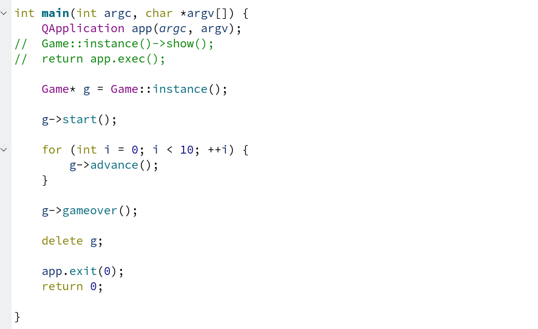

# Izveštaj analize projekta

## O projektu

- Projekat koji će biti analiziran je *Side scroller*, koji se može naći na sledećoj adresi: https://gitlab.com/matf-bg-ac-rs/course-rs/projects-2020-2021/28-side-scroller. 

- Primena alata biće izvršena nad main granom, i commit-om čiji je heš: 97026cfbc3002017bfd9424e3fed3d946bdeddaa

- Side scroller predstavlja igricu 2D karaktera, inspirisana video igrama poput *Megaman* i *Super Mario*, gde igrač treba da stigne do kraja nivo-a, pobedi neprijatelje, i spasi princezu!

- Implementacija projekta je urađena uz pomoć **C++** i **Qt** okruženja.

## Valgrind - Memcheck

- Prvi alat koji je bio korišćen pri analizi projekta jeste *Memcheck*, alat programa *Valgrind*, koji vrši detekciju memorijskih grešaka datog programa.

- Build system koji je bio korišćen za projekat je **qmake**, zato da bismo izgradili projekat, pozivamo sledeće komande:
    ```
    qmake ../side-scroller/side-scroller.pro 
    make
    ```
- Bitno je napomenuti da u *Makefile-u* su dodate opcije **-g -O0**, kako bi se kod preveo u debug mode-u, i bez optimizacija.

- Ako bismo pokrenuli analizu memorije nad trenutnim programom, *memcheck* bi previše pažnje posvetio Qt funkcijama, što nije poželjno (želimo da vidimo da li naš kod napisan pravi probleme sa memorijom). Iz tih razloga, mock-ujemo main funkciju, tako da izgleda ovako: 

    
    tj. želimo da testiramo samo rad najveće klase programa, klase **Game**.

- Pokrenuta je analiza memorije, pozivanjem sledeće komande:
    ```
    valgrind --leak-check=full --track-origins=yes --log-file=valgrind_output_game.txt  ../28-side-scroller/build/side-scroller
    ```
    Izlaz je preusmeren u fajl **valgrind_output_game.txt**, i korišćene su dodatne opcije *--leak-check=full* i *--track-origins=yes* za detaljnije opise.

- Sadržaj fajl-a:

```
==12013== Memcheck, a memory error detector
==12013== Copyright (C) 2002-2017, and GNU GPL'd, by Julian Seward et al.
==12013== Using Valgrind-3.15.0 and LibVEX; rerun with -h for copyright info
==12013== Command: ../28-side-scroller/build/side-scroller
==12013== Parent PID: 2621
==12013== 
==12013== 
==12013== HEAP SUMMARY:
==12013==     in use at exit: 234,076,404 bytes in 19,618 blocks
==12013==   total heap usage: 206,144 allocs, 186,526 frees, 266,224,429 bytes allocated
==12013== 
==12013== 288 (256 direct, 32 indirect) bytes in 1 blocks are definitely lost in loss record 697 of 1,050
==12013==    at 0x483B7F3: malloc (in /usr/lib/x86_64-linux-gnu/valgrind/vgpreload_memcheck-amd64-linux.so)
==12013==    by 0x920C2F4: ??? (in /usr/lib/x86_64-linux-gnu/libfontconfig.so.1.12.0)
==12013==    by 0x920C9B8: ??? (in /usr/lib/x86_64-linux-gnu/libfontconfig.so.1.12.0)
==12013==    by 0x920DFDC: ??? (in /usr/lib/x86_64-linux-gnu/libfontconfig.so.1.12.0)
==12013==    by 0x921506C: ??? (in /usr/lib/x86_64-linux-gnu/libfontconfig.so.1.12.0)
==12013==    by 0x97EC9D9: ??? (in /usr/lib/x86_64-linux-gnu/libexpat.so.1.6.11)
==12013==    by 0x97ED6AF: ??? (in /usr/lib/x86_64-linux-gnu/libexpat.so.1.6.11)
==12013==    by 0x97EAB82: ??? (in /usr/lib/x86_64-linux-gnu/libexpat.so.1.6.11)
==12013==    by 0x97EC04D: ??? (in /usr/lib/x86_64-linux-gnu/libexpat.so.1.6.11)
==12013==    by 0x97EFDBF: XML_ParseBuffer (in /usr/lib/x86_64-linux-gnu/libexpat.so.1.6.11)
==12013==    by 0x9212F42: ??? (in /usr/lib/x86_64-linux-gnu/libfontconfig.so.1.12.0)
==12013==    by 0x921337B: ??? (in /usr/lib/x86_64-linux-gnu/libfontconfig.so.1.12.0)
==12013== 
==12013== 3,812 (16 direct, 3,796 indirect) bytes in 1 blocks are definitely lost in loss record 922 of 1,050
==12013==    at 0x483BE63: operator new(unsigned long) (in /usr/lib/x86_64-linux-gnu/valgrind/vgpreload_memcheck-amd64-linux.so)
==12013==    by 0x11ACC6: Game::Game(QGraphicsView*) (in /home/user/Desktop/2023_Analysis_side-scroller/28-side-scroller/build/side-scroller)
==12013==    by 0x11AE16: Game::instance() (in /home/user/Desktop/2023_Analysis_side-scroller/28-side-scroller/build/side-scroller)
==12013==    by 0x114FCE: main (in /home/user/Desktop/2023_Analysis_side-scroller/28-side-scroller/build/side-scroller)
==12013== 
==12013== 2,359,296 bytes in 1 blocks are possibly lost in loss record 1,049 of 1,050
==12013==    at 0x483B7F3: malloc (in /usr/lib/x86_64-linux-gnu/valgrind/vgpreload_memcheck-amd64-linux.so)
==12013==    by 0x506D6AF: QImageData::create(QSize const&, QImage::Format) (in /usr/lib/x86_64-linux-gnu/libQt5Gui.so.5.12.8)
==12013==    by 0x506D7DE: QImage::QImage(QSize const&, QImage::Format) (in /usr/lib/x86_64-linux-gnu/libQt5Gui.so.5.12.8)
==12013==    by 0x506D81C: QImage::QImage(int, int, QImage::Format) (in /usr/lib/x86_64-linux-gnu/libQt5Gui.so.5.12.8)
==12013==    by 0x5070F05: QImage::convertToFormat_helper(QImage::Format, QFlags<Qt::ImageConversionFlag>) const (in /usr/lib/x86_64-linux-gnu/libQt5Gui.so.5.12.8)
==12013==    by 0x50B2066: QRasterPlatformPixmap::createPixmapForImage(QImage, QFlags<Qt::ImageConversionFlag>) (in /usr/lib/x86_64-linux-gnu/libQt5Gui.so.5.12.8)
==12013==    by 0x50B235D: QRasterPlatformPixmap::fromImage(QImage const&, QFlags<Qt::ImageConversionFlag>) (in /usr/lib/x86_64-linux-gnu/libQt5Gui.so.5.12.8)
==12013==    by 0x50B1356: QPlatformPixmap::fromFile(QString const&, char const*, QFlags<Qt::ImageConversionFlag>) (in /usr/lib/x86_64-linux-gnu/libQt5Gui.so.5.12.8)
==12013==    by 0x50AAB36: QPixmap::load(QString const&, char const*, QFlags<Qt::ImageConversionFlag>) (in /usr/lib/x86_64-linux-gnu/libQt5Gui.so.5.12.8)
==12013==    by 0x11AD01: Game::Game(QGraphicsView*) (in /home/user/Desktop/2023_Analysis_side-scroller/28-side-scroller/build/side-scroller)
==12013==    by 0x11AE16: Game::instance() (in /home/user/Desktop/2023_Analysis_side-scroller/28-side-scroller/build/side-scroller)
==12013==    by 0x114FCE: main (in /home/user/Desktop/2023_Analysis_side-scroller/28-side-scroller/build/side-scroller)
==12013== 
==12013== LEAK SUMMARY:
==12013==    definitely lost: 272 bytes in 2 blocks
==12013==    indirectly lost: 3,828 bytes in 8 blocks
==12013==      possibly lost: 2,359,296 bytes in 1 blocks
==12013==    still reachable: 231,713,008 bytes in 19,607 blocks
==12013==         suppressed: 0 bytes in 0 blocks
==12013== Reachable blocks (those to which a pointer was found) are not shown.
==12013== To see them, rerun with: --leak-check=full --show-leak-kinds=all
==12013== 
==12013== For lists of detected and suppressed errors, rerun with: -s
==12013== ERROR SUMMARY: 3 errors from 3 contexts (suppressed: 0 from 0)       
``` 

- Nakon analiziranja izveštaja datog pokretanjem *memcheck-a*, možemo da zaključimo nešto jako bitno. Naime, iz greške na koju nam ukazuje alat: 
```
==12013== 3,812 (16 direct, 3,796 indirect) bytes in 1 blocks are definitely lost in loss record 922 of 1,050
==12013==    at 0x483BE63: operator new(unsigned long) (in /usr/lib/x86_64-linux-gnu/valgrind/vgpreload_memcheck-amd64-linux.so)
==12013==    by 0x11ACC6: Game::Game(QGraphicsView*) (in /home/user/Desktop/2023_Analysis_side-scroller/28-side-scroller/build/side-scroller)
==12013==    by 0x11AE16: Game::instance() (in /home/user/Desktop/2023_Analysis_side-scroller/28-side-scroller/build/side-scroller)
==12013==    by 0x114FCE: main (in /home/user/Desktop/2023_Analysis_side-scroller/28-side-scroller/build/side-scroller)
```
Dolazimo do zaključka da memorija zauzeta, nikada nije bila oslobođena, što je čudno, pošto je u mock-u main funkcije dodata linija koja bi trebala da oslobodi memoriju koju je zauzela Main klasa, što nas dovodi do zaključka da postoji problem sa *destruktorom* klase. Što i jeste bio problem. **Skoro nijedna od klasa u programu nije imala ispisan destrutor!** Detaljna analiza koda nas dovodi do zaključka da bi sledeći destrutori za klase *Main* i *Button* trebali da nam pomognu da se rešimo curanja memorije:
```
Game::~Game()
{   

    delete health_bar;
    delete player;
    delete pause_screen;
    delete death_screen;

    scene->clear();
    delete scene;
}
```

```
Button::~Button()
{
    delete text;
}
```

- Nakon ponovnog pokretanja alata, pri čemu je izlaz preokrenut u fajl **valgrind_output_game_with_destructor.txt**, primetićemo da smo se rešili ovih problema. U izveštaju nagoveštava da postoje još curenja memorije, ali, ako bismo uporedili statistike pre i posle dodavanja *destruktora*, primetićemo da smo sa: 
    - 3,828 *indirectly lost* bitova spali na 32
    - 2,359,296 *possibly lost* bitova spali na 0
    - 231,713,008 *still reachable* bitova spali na 448,742 
    

- **Zaključak**: Pri izradi programa, nije bilo velike brige u oslobađanju memorije, ali nakon dodavanja par destruktora, imali smo veliki pad u curenju memorije!  

## Valgrind - Massif

- *Massif* je alat *Valgrind-a* koji daje informacije o preseku stanja hipa, u toku izvršavanja programa. Pokrenut je korišćenjem komande:
    ```
    valgrind --tool=massif ../../28-side-scroller/build/side-scroller
    ```

- Time dobijamo fajl *massif.out.14753*, samo što čitanje ovog fajla nije lako čitljivo čoveku, zato koristimo dodatnu komandu, da bi napravio nama čitljiviji fajl:

    ```
    ms_print massif.out.14753 > massif_graph.txt
    ```

- Tj. preusmeravamo izlaz u novi fajl, *massif_graph.txt*! Graf koji je dobijem datom komandom:
```
--------------------------------------------------------------------------------
Command:            ../../28-side-scroller/build/side-scroller
Massif arguments:   (none)
ms_print arguments: massif.out.14753
--------------------------------------------------------------------------------


    MB
224.2^                                                                      : 
     |     @@@@@@@@@@@@@@@@@@@@@@@@@@@@@@@@@@@@@@@@@@@@@@@@@@@@@@@@@@::::@:@#@
     |     @                                                         ::::@:@#@
     |     @                                                         ::::@:@#@
     |     @                                                         ::::@:@#@
     |     @                                                         ::::@:@#@
     |     @                                                         ::::@:@#@
     |     @                                                         ::::@:@#@
     |     @                                                         ::::@:@#@
     |     @                                                         ::::@:@#@
     |     @                                                         ::::@:@#@
     |     @                                                         ::::@:@#@
     |     @                                                         ::::@:@#@
     |     @                                                         ::::@:@#@
     |     @                                                         ::::@:@#@
     |     @                                                         ::::@:@#@
     |     @                                                         ::::@:@#@
     |     @                                                         ::::@:@#@
     |     @                                                         ::::@:@#@
     |     @                                                         ::::@:@#@
   0 +----------------------------------------------------------------------->Gi
     0                                                                   3.349

Number of snapshots: 89
 Detailed snapshots: [2, 5, 11, 13, 15, 16, 36, 47, 53, 55 (peak), 65, 75, 85]

--------------------------------------------------------------------------------
  n        time(i)         total(B)   useful-heap(B) extra-heap(B)    stacks(B)
--------------------------------------------------------------------------------
  0              0                0                0             0            0
  1      8,742,004               40               32             8            0
  2     19,195,457          429,512          392,111        37,401            0
  3     27,344,819          632,392          565,696        66,696            0
  4     36,275,266          708,256          602,445       105,811            0
  5     47,333,858          847,784          707,593       140,191            0
  6     56,041,105          787,696          637,893       149,803            0
  7     63,585,081          850,928          696,274       154,654            0
```

- Iz izveštaja možemo da vidimo da je massif napravio 89 preseka, i izvojio nam je neke od njih. Vrhunac je dostignut u 55, kada je potrošnja hipa bila oko 224.2MB, ali, treba napomenuti da kada se popne do te potrošnje, retko pada. Predpostavka je da program troši toliko veliku količinu hipa, pošto cela mapa je sastavljena od objekata različitih vrsta, pri čemu je svaki objekat predstavljen slikom. Samim tim, mnogo će više hipa trošiti, nego standardni program.

- Ponovo je vršena ista analiza programa, samo što sada pratimo i potrošnju steka. Pozivamo istu komandu, samo što dodajemo opciju *--stack=yes*:

    ```
    valgrind --tool=massif --stack=yes ../../28-side-scroller/build/side-scroller

    ms_print massif.out.15379 > massif_graph_2.txt
    ```

- Rezultat koji dobijamo: 

```
--------------------------------------------------------------------------------
Command:            ../../28-side-scroller/build/side-scroller
Massif arguments:   --stacks=yes
ms_print arguments: massif.out.15379
--------------------------------------------------------------------------------


    MB
224.1^                                                                      # 
     |    @@:@::::::::@::::::::::::::::::::::@:::::::::::::@@:::::::::@:::@:#:
     |    @ :@:: :: ::@:: :::::: ::: ::::: ::@: :::: ::::: @ ::: :::::@:::@:#:
     |    @ :@:: :: ::@:: :::::: ::: ::::: ::@: :::: ::::: @ ::: :::::@:::@:#:
     |    @ :@:: :: ::@:: :::::: ::: ::::: ::@: :::: ::::: @ ::: :::::@:::@:#:
     |    @ :@:: :: ::@:: :::::: ::: ::::: ::@: :::: ::::: @ ::: :::::@:::@:#:
     |    @ :@:: :: ::@:: :::::: ::: ::::: ::@: :::: ::::: @ ::: :::::@:::@:#:
     |    @ :@:: :: ::@:: :::::: ::: ::::: ::@: :::: ::::: @ ::: :::::@:::@:#:
     |    @ :@:: :: ::@:: :::::: ::: ::::: ::@: :::: ::::: @ ::: :::::@:::@:#:
     |    @ :@:: :: ::@:: :::::: ::: ::::: ::@: :::: ::::: @ ::: :::::@:::@:#:
     |    @ :@:: :: ::@:: :::::: ::: ::::: ::@: :::: ::::: @ ::: :::::@:::@:#:
     |    @ :@:: :: ::@:: :::::: ::: ::::: ::@: :::: ::::: @ ::: :::::@:::@:#:
     |    @ :@:: :: ::@:: :::::: ::: ::::: ::@: :::: ::::: @ ::: :::::@:::@:#:
     |    @ :@:: :: ::@:: :::::: ::: ::::: ::@: :::: ::::: @ ::: :::::@:::@:#:
     |    @ :@:: :: ::@:: :::::: ::: ::::: ::@: :::: ::::: @ ::: :::::@:::@:#:
     |    @ :@:: :: ::@:: :::::: ::: ::::: ::@: :::: ::::: @ ::: :::::@:::@:#:
     |    @ :@:: :: ::@:: :::::: ::: ::::: ::@: :::: ::::: @ ::: :::::@:::@:#:
     |    @ :@:: :: ::@:: :::::: ::: ::::: ::@: :::: ::::: @ ::: :::::@:::@:#:
     |    @ :@:: :: ::@:: :::::: ::: ::::: ::@: :::: ::::: @ ::: :::::@:::@:#:
     |    @ :@:: :: ::@:: :::::: ::: ::::: ::@: :::: ::::: @ ::: :::::@:::@:#:
   0 +----------------------------------------------------------------------->Gi
     0                                                                   3.333

Number of snapshots: 63
 Detailed snapshots: [4, 6, 13, 32, 43, 52, 58, 60 (peak)]

--------------------------------------------------------------------------------
  n        time(i)         total(B)   useful-heap(B) extra-heap(B)    stacks(B)
--------------------------------------------------------------------------------
  0              0                0                0             0            0
  1     60,187,272          805,328          648,617       153,703        3,008
  2    110,938,008        3,577,280        3,401,312       172,368        3,600
  3    183,288,691        3,603,488        3,425,264       172,920        5,304
  4    229,698,589      230,323,976      230,144,950       175,394        3,632
  5    313,548,282      230,497,104      230,318,040       175,472        3,592
  6    369,152,517      230,497,176      230,318,040       175,472        3,664
  7    430,328,999      230,497,104      230,318,040       175,472        3,592
  8    487,827,185      230,498,384      230,318,040       175,472        4,872
  9    559,231,383      230,498,384      230,318,040       175,472        4,872
 10    621,718,728      230,498,384      230,318,040       175,472        4,872
 11    704,754,442      230,497,104      230,318,040       175,472        3,592
 12    767,018,449      230,497,176      230,318,040       175,472        3,664
 13    808,457,781      230,498,376      230,318,040       175,472        4,864

```

- Kao što možemo da vidimo, zauzeće memorije je slično kao u prošlom primeru, bez mnogo skokova u memoriji. Kada se dospe do 224MB, ne oscilira mnogo od te vredosti. Čak i potrošnja steka uvek ostaje između 3000 i 4000 bajtova.

- **Zaključak**: Hip se relativno odgovorno koristi. Jeste da postoji veliki skok do 224MB, ali to je posledica same prirode programa, i kad se dospe do te velike potrošnje, retko se diže ili spušta.


